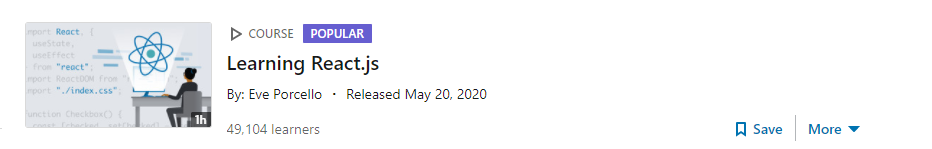
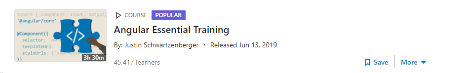
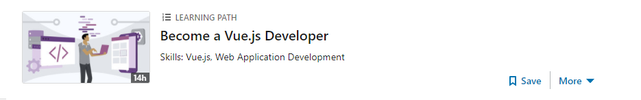

# Top-3 Frontend frameworks
1. React
2. Angular
3. Vuejs


Plus en Minpunten
=====


| Opties | ReactJS | Angular | VueJS |
| ---------- | --------- | ----- | ---- |
| +   | Enorm geavanceerd | Ingebouwde functionaliteit voor updaten | Grote documentatie |
| +   | Goeie performance | Kleinere code | Typescript support |
| +   | Het hergebruiken van componenten | Een grote community voor support | Flexibel design voor app structuren |
| -   | (Te)veel updates | Performance minder | Niet enorm stabiel voor componenten |
| -   | Erg complex | Sommige applicatie draaien niet soepel | Kleine communnity voor support |
| -   | Alleen frontend oplossingen | Veel complexe errors | Veel plugins geschreven in andere talen |

Snelste stijger
=====

De snelste stijger van dit moment is **React.js**, met een enorme groei begin 2020 is het momenteel het grootste framework voor frontend.

### ReactJS

Framework in gebruik
=====

### ReactJS
```
ReactDOM.render(
  <h1>Hello, world!</h1>,
  document.getElementById('root')
);
```

### Angular

```
<h1 ng-controller="HelloWorldCtrl">{{message}}</h1>
<script>  
    angular.module("app", []).controller("HelloWorldCtrl", function($scope) {  
    $scope.message="Hello World" 
    } )
</script> 
```

### VueJS

```
<div id="hello-world-app">
    <h1>{{ msg }}</h1>
</div>
<script>
    new Vue({
    el: "#hello-world-app",
    data() {
        return {
        msg: "Hello World!"
        }}
    });
</script>
```

# Linkedin learning
#####

### ReactJS

[](https://www.linkedin.com/learning/paths/become-a-vue-js-developer)

### Angular

[](https://www.linkedin.com/learning/angular-essential-training-2)

### VueJS

[](https://www.linkedin.com/learning/paths/become-a-vue-js-developer)